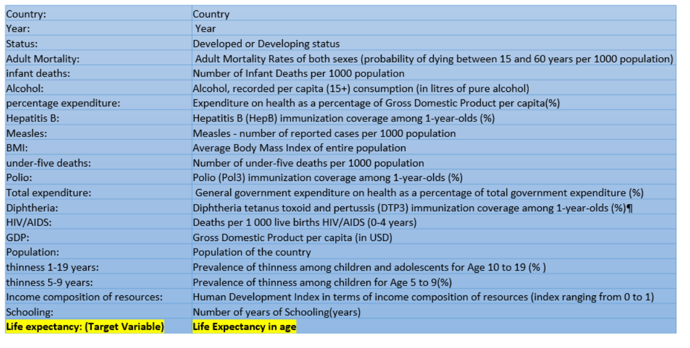
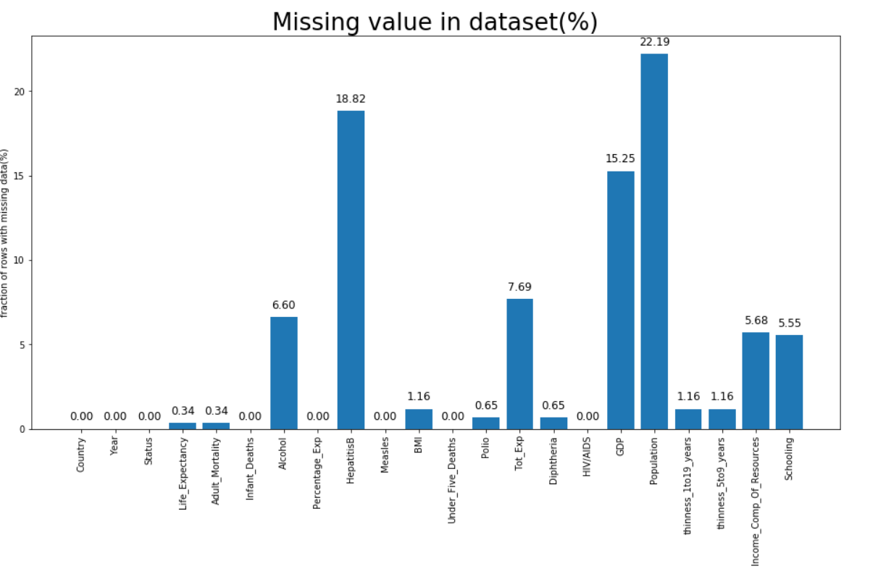
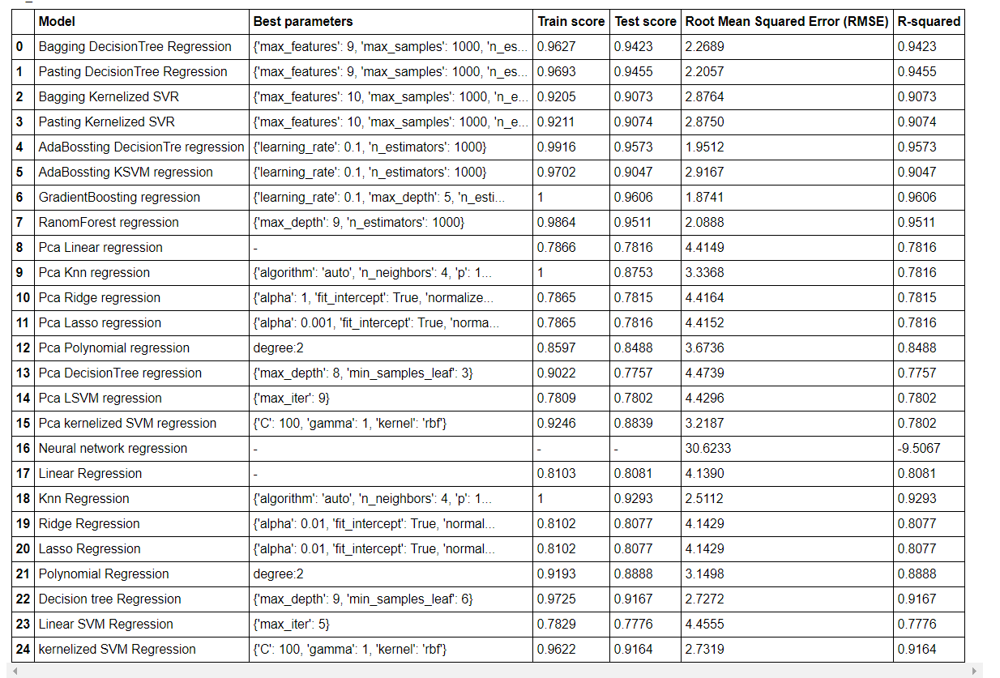
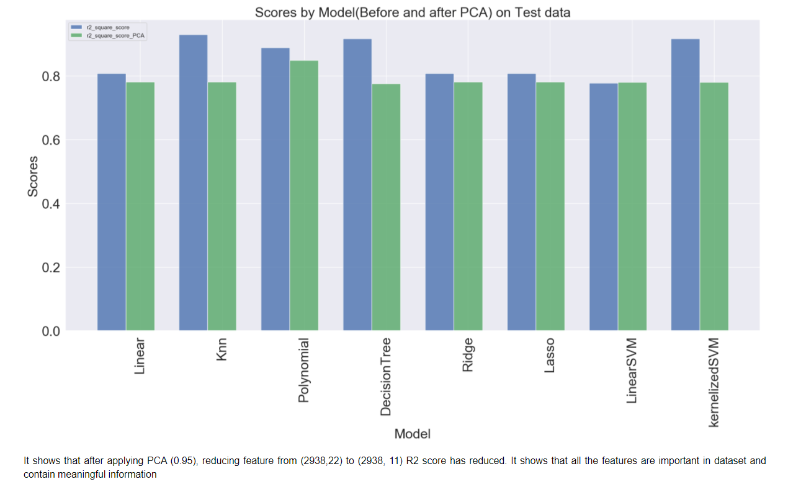
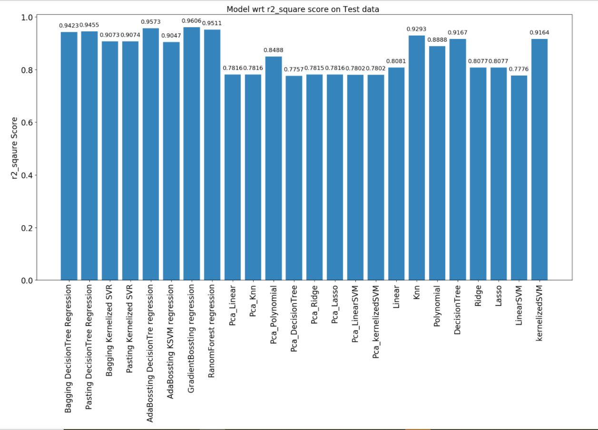

# Life-expectancy-prediction-WHO-
Statistical Analysis on factors influencing Life Expectancy

# Project Objective: To predicts life expectancy of an individual by observing  the Immunization related factors, Mortality factors, Economical factors and Social factors which impacts life expectancy

# Data Description:
Dataset feature: Shape of dataset :- (2938,22)

# Data Cleaning:
The data was checked for missing and Duplicate values. 
- Replace NaN in each column with the respective column Median
- Renamed some column names as they contain trailing spaces e.g. Who_df.rename(columns={" BMI ":"BMI", },inplace=True)
- Mapped 'Developing':0,'Developed':1 in Column 'Status’
- Dropped  column ‘country’ as it has 193 unique value
- Dropped  column 'Under_Five_Deaths','thinness_5to9_years','Percentage_Exp

# Feature Engineering
Used Min Max Scaling to normalise data

# Evaluation Metrics for Regression
For Regression tasks, the best model is evaluated on the basis of r2 Square score followed by least Root Mean Squared error (RMSE) followed by Train and Test Scores

# Model
## Build almost 24 model
'Bagging DecisionTree Regression','Pasting DecisionTree Regression','Bagging Kernelized SVR','Pasting Kernelized SVR',
           'AdaBossting DecisionTre regression','AdaBossting KSVM regression','GradientBossting regression','RanomForest regression',
           'Pca_Linear', 'Pca_Knn','Pca_Polynomial','Pca_DecisionTree','Pca_Ridge','Pca_Lasso',
           'Pca_LinearSVM','Pca_kernelizedSVM','Linear', 'Knn','Polynomial','DecisionTree','Ridge','Lasso','LinearSVM','kernelizedSVM'
 

 # Important feature using Random Forest
 
 
 # PCA 
 
           
 # Result 
 Best Regression Model:
 GradientBoosting regression
 R2 score = 0.9606¶

